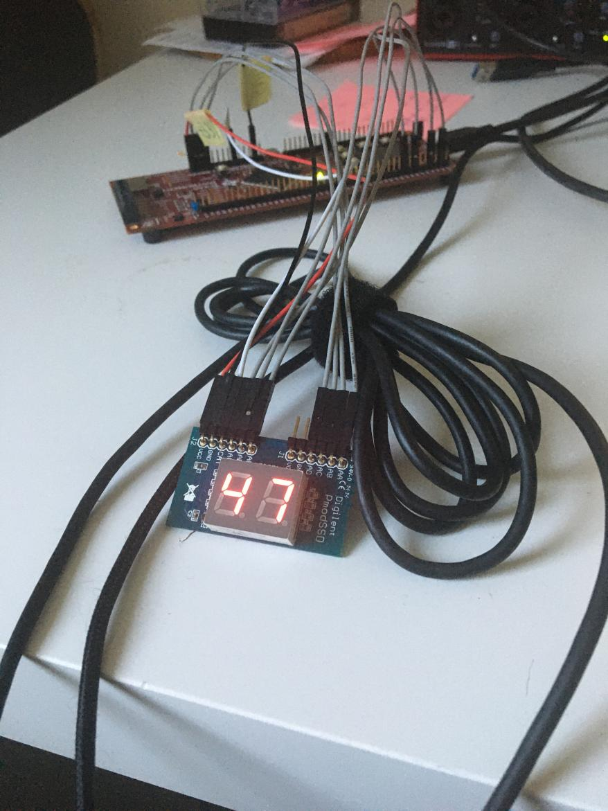
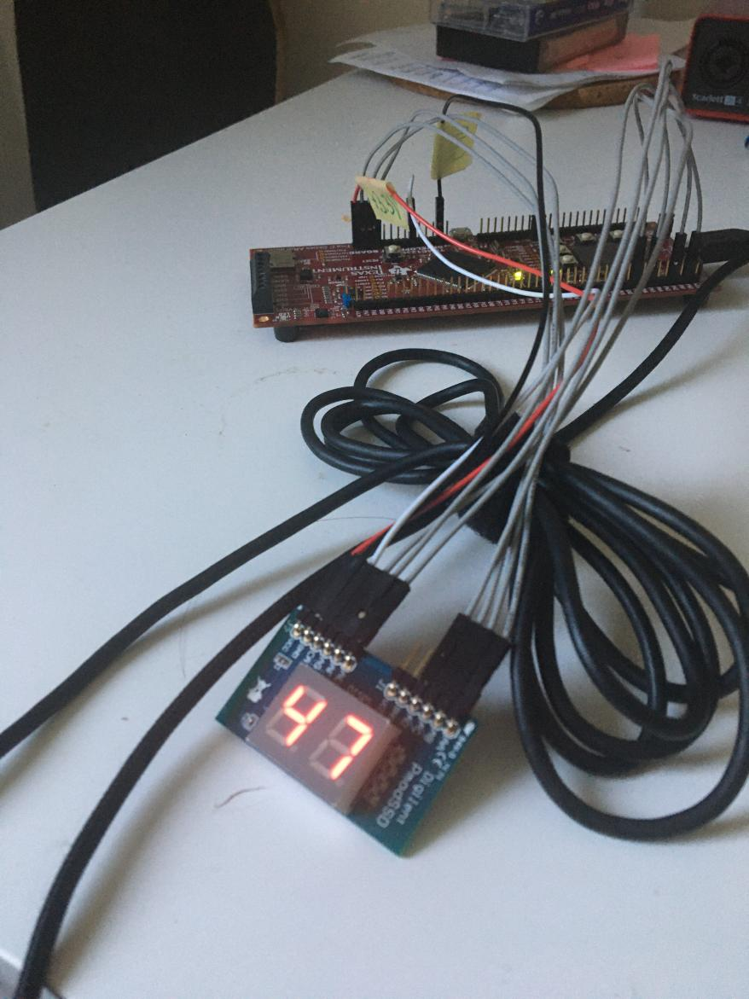

# E. Wyświetlacz 7-segmentowy LED

## E.1. Statyczny obraz

[Kod do zadania E.1.](./e1.c)

### Jaka jest teoretycznie maksymalna moc, z jaką może się świecić każdy z segmentów?

`Sumarycznie 100% mocy PWM.`

### Czy oba segmenty świecą się z jednakową mocą? 

`Tak`

## E.2. Optymalizacja jasności

[Kod do zadania E.2.](./e2.c)

## E.3. Ruchomy obraz 

[Kod do zadania E.3.](./e3.c)

