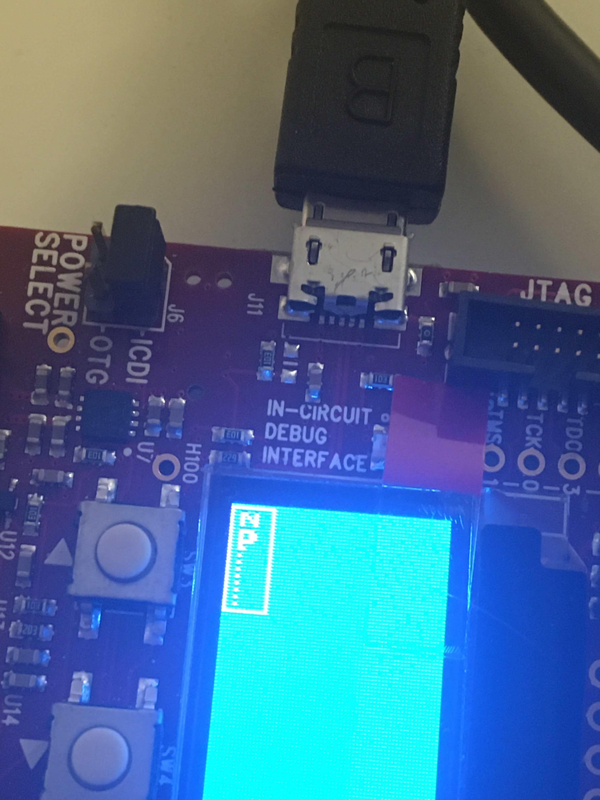

# Wstęp do Systemów Wbudowanych – Laboratorium/Projekt

*Polina Grińko, Paweł Kasjaniuk, Szymon Tomulewicz, Jarosław Węgliński - (Zespół E)*

# A. Aplikacja demonstracyjna

## A.1. Demonstracja wybranych funkcji

### Jakie wielkości są wyświetlane na widocznych wykresach i od czego zależą
wyświetlane wartości (w szczególności, jak pokazać, że zachodzą zmiany?)

Na wykresach przedstawiane były parametry różnych czujników m.in. żyroskopu.
Zmiany wartości uzyskujemy np. manipulując nachyleniem płytki.

*Filmik:*

# B. Włączanie diody

## B.2. Uruchomienie/gaszenie diody

[Kod do zadania B.2.](./B/b2.c)

## B.3. Sterowanie bezpośrednie

[Kod do zadania B.3.](./B/b3.c)

### Jaki stan przycisku związany jest z jakim stanem diody?

Dioda przyjmuję przeciwny stan w stosunku do przycisku. Naciśnięcie przycisku
powoduje zgaszenie diody.

*Filmik:*

## B.4. Sterowanie niebezpośrednie

[Kod do zadania B.4.](./B/b4.c)

*Filmik:*

# C. Opóźnienia programowe i sprzętowe

## C.1. Opóźnienie programowe

[Kod do zadania C.1.](./C/c1.c)

### Ile cykli potrzeba do wykonania 500 ms opóźnienia?

16 MHz / 16 = 1 MHz = 0.001ms (okres)

500 ms / 0.001ms = 500000

*Filmik:*

Okres mrugania diody nie różnił się zauważalnie od 500ms.

## C.2. Opóźnienie programowe – wersja ROM

[Kod do zadania C.2.](./C/c2.c)

*Filmik:*

## C.3. Licznik czasu

[Kod do zadania C.3.](./C/c3.c)

### Maksymalna wartość, która zmieści się w połowie licznika

`2^16 - 1 = 65535`

### Maksymalna wartość, która zmieści się w całym liczniku?

`2^32 - 1 = 4 294 967 295`

### Liczba potrzebna do zmieszczenia wszystkich cykli?

`625000`

### Który typ licznika (połowiczny czy pełny) pomieści potrzebną liczbę cykli?

Wyłącznie pełny licznik jest w stanie pomieścić potrzebną liczbę cykli.

### Dlaczego ładujemy do timera liczbę cykli pomniejszoną o jeden?

Ponieważ timer resetuje się przy przejściu przez zero, a nie na samej wartości zera.

### Jaki jest maksymalny czas, który może zmierzyć licznikiem pełnej długości?

4,294,967,295 * 0.001ms

*Filmik:*

# D. Kontrola mocy PWM

## D.1. Statyczny PWM

[Kod do zadania D.1.](./D/d1.c)

### Ustalone dane

- Dioda D2 - Port P, końcówka 3
- Numer PWM: 3
- Moduł PWM: 0
- Generator PWM: 7

*Filmik:*

## D.2. Sterowanie PWM w czasie z wykorzystaniem licznika

[Kod do zadania D.2.](./D/d2.c)

*Filmik:*

# E. Wyświetlacz 7-segmentowy LED

## E.1. Statyczny obraz

[Kod do zadania E.1.](./E/e1.c)

### Jaka jest teoretycznie maksymalna moc, z jaką może się świecić każdy z segmentów?

Sumarycznie 100% mocy PWM.

### Czy oba segmenty świecą się z jednakową mocą?

Tak.

## E.2. Optymalizacja jasności

[Kod do zadania E.2.](./E/e2.c)

## E.3. Ruchomy obraz

[Kod do zadania E.3.](./E/e3.c)

# F. Wyświetlacz OLED

## F.1. Statyczny obraz

[Kod do zadania F.1.](./F/f1.c)

*Zdjęcie:*

## F.2. Ruchomy obraz

[Kod do zadania F.2.](./F/f2.c)

*Filmik:*

# G. Obsługa przerwań

[Kod do zadania G.1.](./G/g1.c)

